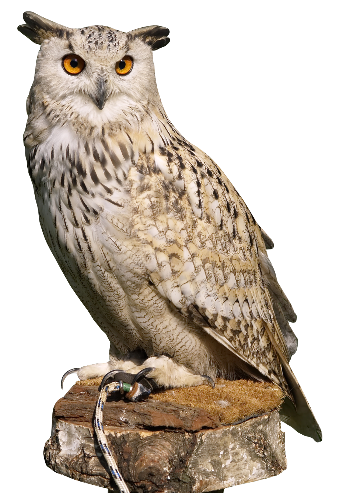

# Introduction
<!-- Direct LaTex code -->
\centering
\resizebox{0.95\textheight}{!}{%
\begin{tikzpicture} %[scale=0.2]

\node[anchor=north east,xshift=0.8pt,yshift=2pt, opacity=0.3] at (current page.north east) {\includegraphics[width=0.2\paperwidth]{IRlogored.png}};

\draw[line width=2 mm] circle[radius=7.4 cm];    % outer circle
\draw[ultra thick] circle[radius=6 cm] circle[radius=7 cm];
		
\path[%rotate=-15.2,
postaction={decoration={ text along path, text format delimiters={|}{|},
	  text={	|\Huge| WELCOME DG and Spl.DG(VD)
				%{ \pgfornament[scale=.4, ydelta=-9 pt]{15} }
				},  text align=center, reverse path }, 	decorate  }
		] (-27:6.2cm) arc (-27:210:6.2cm);   
		\path [postaction={decorate,decoration={text along path, text align=fit to path,text={|\Huge| AND ALL OFFICERS }}}] (209:6.8cm) arc (209:330:6.8cm);
		
\node[] at (0,0.0){\includegraphics[height=11.8cm,width=11.8cm]{IRlogored.png}};
\end{tikzpicture}
}

# torn paper text

# do copy old good print

Markdown allows you to format text with  *emphasis* and **strong emphasis**. You can also add superscripts^2^, subscripts~2~, and display code `verbatim`. Little known fact:
you can also ~~strikethrough~~ text and present it in [small caps]{.smallcaps}.

You can embed [links with names](https://quarto.org/),direct urls like <https://quarto.org/>, and links to [other places](#inline-elements-text-formatting) in the document. The syntax is similar for embedding an inline image: .

The area of a circle is $A = \pi r^2$,where
$r$ is the radius and $\pi$ is the constant
$3.141592\ldots$.

# What is Vendor Management

Here is a short note.^[Small enough to fit inline.]

Here is a longer footnote[^1]

[^1]: This footnote can be placed in a separate block.
The identifier can be any alphanumeric string.

<!-- some problem code None now !
--->

# Orgenisation str

Unordered list:

* red
* green
* blue

Ordered list:

1. First item...

   ...Continued.

1. Second item 

1. Third item

# A larger equation:

$$ 
f(x)={\sqrt{\frac{\tau}{2\pi}}}
      e^{-\tau (x-\mu )^{2}/2}
$$

This breaks it:

$$
\bar{x} = \sum_{i=i}^n x_1
$$

# ithtt test 

Images on their own line  or do they?

Images on their own line become a block:

or do they?

### Vendor is a partner
- Vendor gives better technology or service /cost economies
- must be nurtured
- within the rules of constitutional equality among persons/business entity 

## RDSO vendor management activities

1. Item identified and assigned by Railway Board 
2. RDSO develop Specification including STR and indicative costing
3. RDSO Solicit vendors interest
4. Entire Vendor Application processing on RDSO UVAM portal at ireps.gov.in
5. Undertake Inspection of classified Category-II critical items 
6. Evaluate Vendor performance for up-gradation and corrective actions
7. Failure reporting monitoring and regular and special audits 

## RDSO Vendor Development process and monitoring

### Specification development

- RDSO follow the basic principles of WTO-TBT ‘Code of Good Practice for the Preparation, Adoption and Application of Standards’. 

- The six principles of standardisation:
     a) Transparency 
     b) Openness 
     c) Impartiality and Consensus 
     d) Effectiveness and Relevance
     e) Coherence 
     f) Development Dimension

## Standards

### What are Standards
> Document established by consensus amongst various stakeholders and provides for common and repeated use, rules, guidelines or characteristics for specific products or services and is aimed at achieving optimum degree of order in a given context. 
These could be specifications, procedures and guidelines to ensure that products, services and systems are safe, consistent and reliable. 

## Quality key items to consider (suggestions)

### 7 QC tools -  Ishikawa,professor, Tokyo Uni,  influencer of W. Edwards Deming 
Solves about ~ 95% of all company problems 

1. Pareto Chart
2. Run Chart - run-sequence plot
3. Histogram - underlying distribution - process capability
4. Cause-and-effect diagram - Ishikawa fishbone diagram : root causes for an effect into six Ms: measurement, material, machine, method, manpower and mother nature.  Brainstorming "why does this happen?" 
5. Scatter plots : X-Y graph data relationship but no  causation
6. Control charts : processes variation from specs.( x-bar ,  R , S , c , u , np and p chart)
7. Check Sheets : defect concentration diagram, structured forms

Vendors following above likely to have robust internal quality control system

## Few Suggestions for discussions

### Documentation and legal compliances 
- Based on certificate from statutory charted accountant
- All CCA compliance by chartered engineering firms
- RDSO can always verify and cross check certificates
- like system of Advocates in Court, CA for company accounts, CHA for export

- Ways to incentivise vendors meeting better process capabilties (Cp)

## Thank you very much
### Thank you very much
Thank you

# test columns with 4 columns in html not worked well

:::: {.columns align=center totalwidth=8em}

The div containers with classes columns and column can optionally have an align attribute. 
The class columns can optionally have a totalwidth attribute or an onlytextwidth class.

Vertical with the values top, top-baseline, center and bottom to vertically align the columns

class columns can optionally have a totalwidth attribute or an onlytextwidth class.

::: {.column width="40%"}
contents...
:::

::: {.column width="60%" align=bottom}
contents...
:::

:::: 
